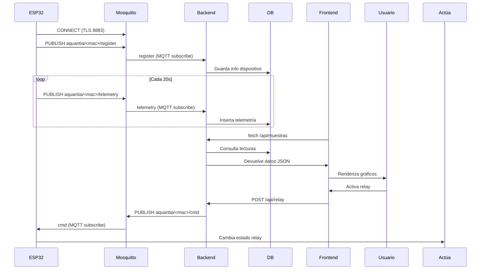
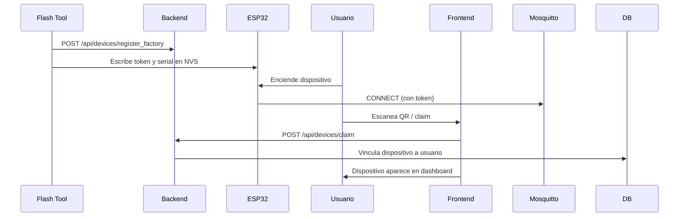

# Arquitectura y Estructura del Sistema Aquantia

## 1. Diagrama general de componentes

```mermaid
graph TD
  subgraph Dispositivos
    ESP32[ESP32 (METEO/IRRIGATION)]
  end
  subgraph Backend
    Flask[Flask API]
    MQTTClient[MQTT Client (paho-mqtt)]
    DB[(TimescaleDB/PostgreSQL)]
  end
  subgraph Infraestructura
    Mosquitto[Broker MQTT (Mosquitto)]
    Nginx[Nginx (Proxy/TLS)]
  end
  subgraph Usuario
    Browser[Navegador (React/Vite)]
  end

  ESP32 -- MQTT/TLS 8883 --> Mosquitto
  Mosquitto -- MQTT 1883 --> MQTTClient
  MQTTClient -- ORM --> DB
  Flask -- REST --> Browser
  Nginx -- Proxy /api/* --> Flask
  Browser -- HTTPS 443 --> Nginx
```

---

## 2. Flujo de datos y eventos principales



---

## 3. Provisioning y vinculación de dispositivos



---

## 4. Despliegue y desarrollo

- **Local:**
    - `docker compose up -d` levanta TimescaleDB, Mosquitto, Backend y Adminer.
    - Frontend: `npm run dev` (Vite en 5173, proxy a Flask 7000).
- **Producción:**
    - El frontend se compila localmente y se sube el `dist/` al repo.
    - En el servidor: `./deploy.sh` hace `git pull` y `docker compose up -d --build`.
    - Nginx sirve el frontend y hace proxy a Flask.

---

## 5. Resumen de tecnologías

| Capa           | Tecnología principal                        |
|----------------|--------------------------------------------|
| Backend API    | Python 3.12, Flask, flask-cors, JWT        |
| Base de datos  | TimescaleDB (PostgreSQL 16)                |
| Broker MQTT    | Mosquitto 2 + go-auth                      |
| Cliente MQTT   | paho-mqtt                                  |
| Frontend       | React 18, Vite, Tailwind, ApexCharts       |
| Contenedores   | Docker + Docker Compose                    |
| Proxy / TLS    | Nginx (HestiaCP) + Let's Encrypt           |
| Firmware       | ESP32 (C++/Arduino, perfiles METEO/IRRIG)  |

---

> Para detalles de endpoints, tablas y payloads, ver README principal.
